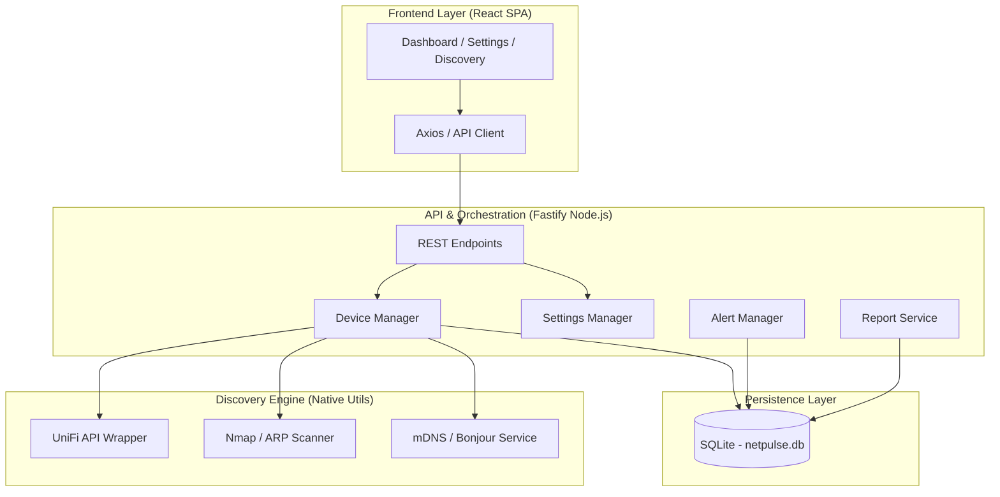

# NetPulse System Architecture

NetPulse is built using a modern **Layered Architecture** designed for high performance, low resource consumption, and ease of deployment. 

## 🏗️ High-Level Component Map

---

## 💻 Technical Stack & Justification

### 1. Backend: Fastify (Node.js)
- **Why Fastify?** We chose Fastify over Express for its **zero-overhead** philosophy and first-class TypeScript support. It is significantly faster in JSON serialization, which is critical for smooth SSE (Server-Sent Events) and real-time dashboard updates.
- **Service Pattern**: Business logic is decoupled into singleton services (`DeviceManager`, `NetworkScanner`). This makes the code highly testable and allows for easy swapping of discovery methods.

### 2. Database: better-sqlite3
- **Why SQLite?** For a local network tool, a separate database server (like PostgreSQL) is overkill. `better-sqlite3` is an in-process, synchronous driver that provides incredible performance without the latency of network-based DB calls.
- **Justification**: It keeps the Docker image light and ensures zero-config persistence across container restarts.

### 3. Discovery Engine: Multi-Layered Approach
- **Nmap (-sn -PR)**: Used for rapid ARP-based discovery. It is far more reliable than standard ICMP pings, as many modern firewalls block ping but must respond to ARP.
- **Bonjour-Service**: Implements mDNS (Multicast DNS). 
    - **Justification**: This allows NetPulse to identify "silent" IoT devices (printers, smart speakers, HomeKit) and automatically resolve their hostnames and capabilities without manual naming.
- **UniFi API**: For power-users, we integrate directly with the controller.
    - **Justification**: This provides Layer-3 data (DPI info, fixed IP status) that cannot be found via local scanning alone.

### 4. Frontend: Vite + React + Tailwind
- **Vite**: Modern build tool providing near-instant HMR (Hot Module Replacement) during development.
- **Tailwind CSS**: Enables a bespoke "Glassmorphism" UI without the weight of a traditional UI library like Material UI.
- **Decision**: We use relative API paths to allow the frontend to work seamlessly behind proxies (Nginx Proxy Manager) without needing a specific build for every domain.

---

## 🔒 Security Architecture
- **Environment Isolation**: Sensitive credentials (UniFi passwords, SMTP tokens) are stored in `.env` and never leaked to the frontend.
- **Proxy-Ready**: Built-in support for `BASE_URL` allows for secure HTTPS termination via Nginx Proxy Manager, which is the recommended way to expose the app to the public internet.

## 📈 Data Flow: The "Shadow Loop"
1. **Trigger**: A background `setInterval` or manual "Scan Now" button triggers `DeviceManager.sync()`.
2. **Discovery**: `NetworkScanner` runs concurrent Nmap and mDNS probes.
3. **Merging**: `DeviceManager` compares scan results with existing database records. It prefers UniFi data for hostnames but relies on scanners for online/offline status.
4. **Offline Detection**: Devices not seen for $X$ minutes (configurable) are transitioned to `UNSTABLE` and then `OFFLINE`, triggering the `AlertManager`.
